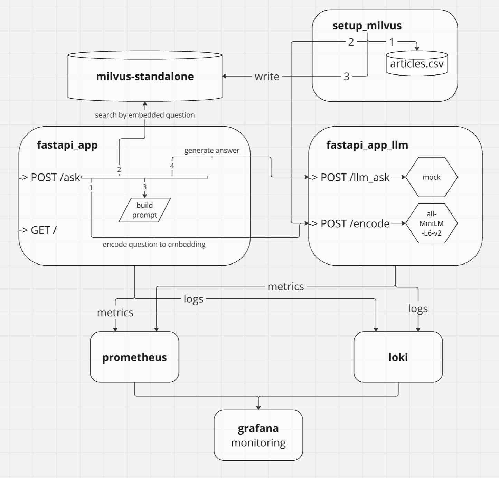
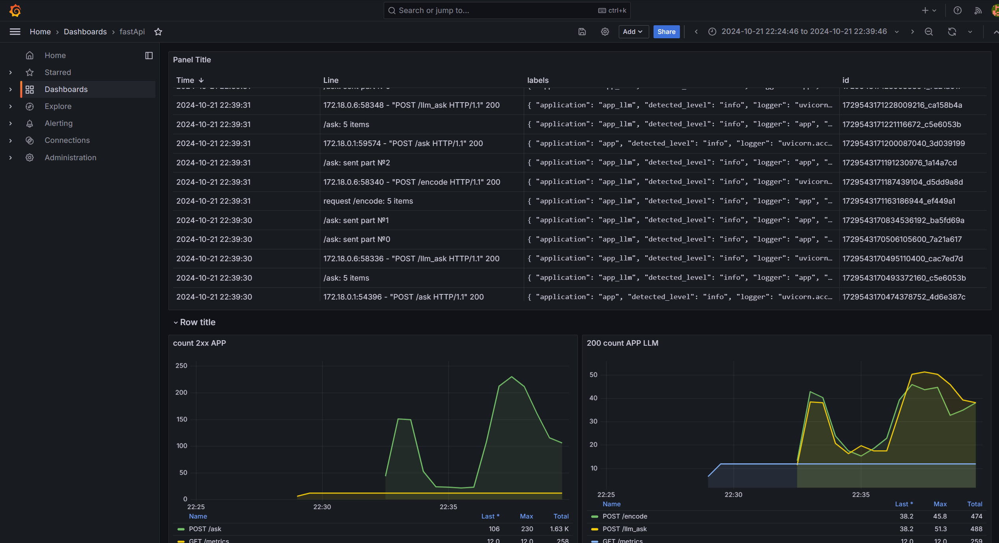

# LLM QA System

[Русский](./README.ru.md) | [English](./README.md)

Question answering system with grounding

## Table of Contents

- [Table of Contents](#table-of-contents)
- [Architecture](#architecture)
  - [fastapi_app](#fastapi_app)
  - [fastapi_app_llm](#fastapi_app_llm)
  - [setup_milvus](#setup_milvus)
  - [milvus-standalone](#milvus-standalone)
  - [prometheus, loki, grafana](#prometheus-loki-grafana)
- [Launch Instructions](#launch-instructions)
  - [Application](#application)
  - [Testing](#testing)
  - [Load Testing](#load-testing)

## Architecture:

The core application is divided into two parts, which improves:

- **Development**: It reduces the complexity of the application and resource management, eliminating the need to balance between CPU-bound and IO-bound tasks, which require different approaches to computation.
- **Scalability**: You can allocate nodes and workers specifically to the part of the application that needs more resources.

Everything is delivered via Docker Compose.

When scaling, it's also necessary to separate auxiliary tools (db, metrics, logs) into dedicated machines.



Logical nodes are Docker containers, here is their description.

### fastapi_app

The main application, serves as the entry point.

- `GET /` - returns simple title.
- `POST /ask` - answers the given question by supplementing it with materials.

The application is asynchronous and does not have CPU bound parts; all waiting is I/O bound, and there are three:
- `POST /encode` request
- Database search
- `POST /llm_ask` request

A ThreadPoolExecutor is used for database operations with multiple threads.
Currently, a new synchronous connection to the database is opened with each endpoint call, but in the future, a connection could be taken from the connection pool instead of opening a new one.

### fastapi_app_llm

A supporting application. It is synchronous and CPU/GPU bound.
Performs calculations on models (real and mocked).

- `GET /llm_ask` respond with Server-Sent-Events with answers to the prompt from the mock LLM. 
    
    Mock algorithm returns random substrings from the query context. The number of response events is equal to the number of articles.
- `POST /encode` uses SentenceTransformer ([model](https://huggingface.co/sentence-transformers/all-MiniLM-L6-v2)) to encode the incoming message and returns a vector.

Both endpoints accept batch requests. 

### setup_milvus

A one-time container that loads data from the [dataset](https://www.kaggle.com/datasets/asad1m9a9h6mood/news-articles/data) into the database.

Logically, it has three parts:
1) Read the dataset from a file
2) Generate encodings for the strings from the dataset
3) Upload the data with their encodings to the database

### milvus_sstandalone

A vector database specializing in fast searches with large data volumes.

This application uses the "standalone" deployment method, as it is a simple approach that meets the requirements. According to the documentation, standalone is applied for cases storing up to 100 million vectors.

In the future, when scaling up, it could be possible to switch to a distributed system without changing the application's logic.

In the [setup_milvus](#setup_milvus) section, a partition is created by the key `topic`, which will significantly speed up searches.

### prometheus, loki, grafana

- **Prometheus** is used for collecting metrics. The metrics themselves are created using the `prometheus-fastapi-instrumentator` package on top of the FastAPI application, but custom metrics can be added if necessary (for example, CPU load of the container).
- **Loki** serves as a single point for collecting logs from all applications.
- **Grafana** is used for displaying metrics and logs.

Example monitoring screen:



## Launch Instructions

### Application

Run commands from the root of the project

1. 
   - Option 1: run `docker compose up setup --build` to create and fill the database.
   - Option 2: Extract the DB volume [milvus.zip](./volumes/milvus.zip) to the [./volumes/](./volumes) directory.
2. run `docker compose up grafana --build -d` to run Grafana.
3. run `docker compose up app --build` to run the main application.

- The application (swagger) will be available at http://127.0.0.1:8000/docs
- The application (swagger) with LLM: http://127.0.0.1:8080/docs
- Monitoring: http://127.0.0.1:3000. login: `admin`, pwd: `admin`
- prometheus: http://127.0.0.1:9090

### Testing

There are tests for `app_llm`, which are independent and can be run at any time.

For `app`, only integration tests are ready; they can only be run after executing the command
`docker compose up app_llm --build`.

Tests are run with the command `pytest` from the module directory.

### Load testing

Load testing can also be performed. To do this, start the application and run the command:

```commandline
locust -f ./locust_testing/locustfile.py
```

Then specify the host: `http://127.0.0.1:8000` and other parameters in the [interface](http://localhost:8089)