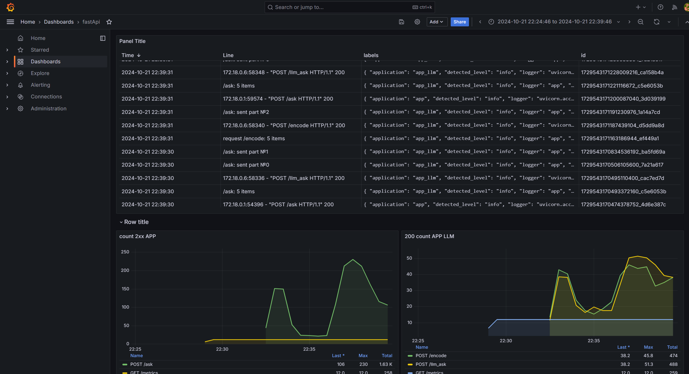

# LLM QA System

[Русский](./README.ru.md) | [English](./README.md)

Система ответов на вопросы с учетом контекста знаний

## Оглавление

- [Оглавление](#оглавление)
- [Архитектура](#архитектура)
    - [fastapi_app](#fastapi_app)
    - [fastapi_app_llm](#fastapi_app_llm)
    - [setup_milvus](#setup_milvus)
    - [milvus-standalone](#milvus-standalone)
    - [prometheus, loki, grafana](#prometheus-loki-grafana)
- [Инструкция по запуску](#инструкция-по-запуску)
    - [Приложение](#приложение)
    - [Тестирование](#тестирование)
    - [Нагрузочное тестирование](#нагрузочное-тестирование)

## Архитектура:

Основное приложение разбито на два, это позволило улучшить:

- **Разработку**. Уменьшается сложность приложения и управления ресурсами: не нужно балансировать между cpu и io
  задачами, которые требуют разные подходы к вычислению.
- **Масштабирование**. Можно выделить нод и воркеров именно в той части, где их не хватает

Все вместе поставляется через docker-compose.

При масшабировании также необходимо разделить вспомогательные инструменты (db, metrics, logs) по отдельным машинам.


Логические узлы выделены в докер контейнеры, вот их описание

### fastapi_app

Основное приложение, является точкой входа.

- Ручка `GET /` возвращает простой заголовок
- Ручка `POST /ask` отвечает на заданный вопрос, дополняя материалами.

Приложение асинхронное и не имеет cpu-нагруженных частей, все ожидание является io-bound, их 3:

- Запрос `POST /encode`
- Поиск в базе
- Запрос `POST /llm_ask`

При работе с базой данных используется ThreadPoolExecutor на несколько потоков.
На данный момент при каждом вызове ручки открывается новое синхронное подключение к базе,
но в перспективе вместо открытия будет браться подключение из пулла коннекшенов.

### fastapi_app_llm

Вспомогательное приложение. Является синхронным и cpu/gpu-нагруженным.
Выполняет вычисления на моделях (настоящей и моке).

- Ручка `GET /llm_ask` отдает стрим с ответами на prompt от мока llm.

  Алгоритм мока возвращает случайные подстроки из контекста запроса. Количество событий ответа равно количеству статей.
- Ручка `POST /encode` использует
  SentenceTransformer ([модель](https://huggingface.co/sentence-transformers/all-MiniLM-L6-v2)) для кодирования
  входящего сообщения и отдает вектор.

Обе ручки принимают батч запросов.

### setup_milvus

Одноразовый контейнер, который загрузит данные
из [датасета](https://www.kaggle.com/datasets/asad1m9a9h6mood/news-articles/data) в базу данных

Логически имеет 3 части:

1) Прочитать датасет из файла
2) Собрать энкодинги для строк из датасета
3) Загрузить в БД данные с их энкодингами

### milvus_standalone

Векторная база данных, специализирующаяся на быстром поиске при больших объемах данных.

В этом приложении использован standalone способ деплоя, так как это является достаточно простым способом и подходит под
требования,
так как, согласно документации, standalone применяется для случаев хранения до 100 миллионов векторов.

В дальнейшем, при масштабировании можно будет перейти на распределенную систему, не меняя при этом логику приложения.

Также стоит отметить, что в секции [setup_milvus](#setup_milvus) создается партиция по ключу `topic`, что позволит в
разы ускорить поиск.

### prometheus, loki, grafana

- **prometheus** служит для сбора метрик. Сами метрики создаются пакетом `prometheus-fastapi-instrumentator` поверх
  fastapi приложения,
  но при необходимости можно добавить свои (например загрузку cpu контейнера)
- **loki** служит единой точкой сбора логов из всех приложений
- **grafana** служит для отображения метрик и логов.

Пример экрана мониторинга



## Инструкция по запуску

> **_NOTE:_**  Чтобы увидеть SSE в swagger, откройте вкладку Network в браузере

### Приложение

Команды запускаются из корня проекта

1.
    - Вариант 1: выполните `docker compose up setup --build` чтобы инициировать и заполнить базу данных
    - Вариант 2: распакуйте [milvus.zip](./volumes/milvus.zip) в [./volumes/](./volumes) папку
2. Выполните `docker compose up grafana --build -d` для запуска grafana
3. Выполните `docker compose up app --build` для запуска основного приложения

- Приложение (swagger) будет доступно по адресу http://127.0.0.1:8000/docs
- Приложение (swagger) с моделями: http://127.0.0.1:8080/docs
- Мониторинги: http://127.0.0.1:3000. login: `admin`, pwd: `admin`
- prometheus: http://127.0.0.1:9090

Альтернативно можно запустить все сразу `docker compose up --build`

### Тестирование

Есть тесты для `app_llm`, они независимы и их можно запустить в любой момент

Для `app` написаны только интеграционные тесты, их можно запустить только после выполнения команды
`docker compose up app_llm --build`

тесты запускаются командой `pytest` из директории модуля.

### Нагрузочное тестирование

Также можно запустить нагрузочное тестирование. Для этого запустите приложение и выполните команду

```commandline
locust -f ./locust_testing/locustfile.py
```

После чего укажите host: `http://127.0.0.1:8000` и другие параметры в интерфейсе